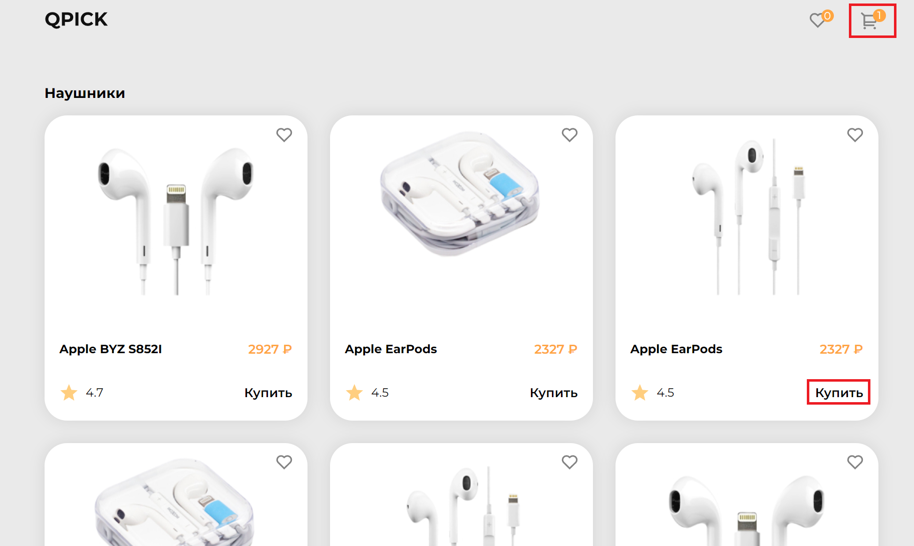
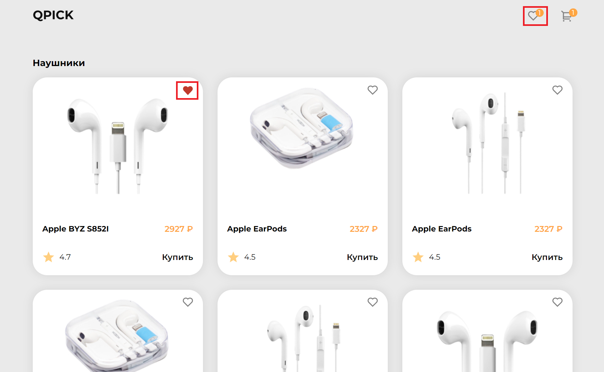
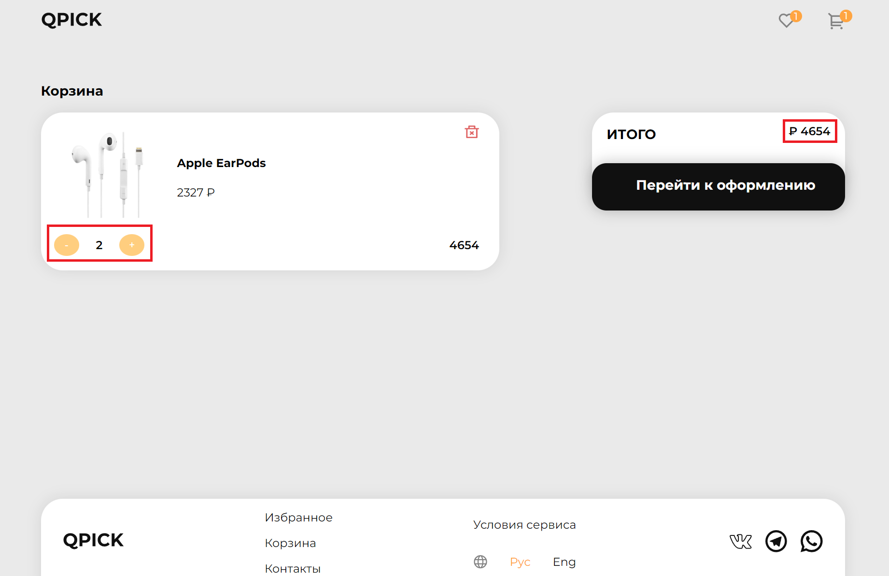

# О проекте

Проект представляет из себя интернет магазин аудио аксессуаров, состоящий из 3 страниц. Первая страница - каталог товаров, вторая - избранные, третья - корзина с приобретенными товарами

---

# Функционал

При нажатии на кнопку "Купить" товар добавляется в корзину и счетчик рядом с иконкой корзины увеличивается, при удалении товарa, счетчик уменьшается

Так же товар можно добавить в избранное, нажав на иконку в форме сердца

При изменение количества товаров в корзине, изменяется общая сумма конкретного товара и итоговая сумма

---

# Технологии и инструменты

- React
- Redux Toolkit
- JSON Server
- Docker

React SPA приложение в связке с Redux Toolkit, запросы на JSON Server осуществляются через Redux Async Thunk с использование axios, Redux Persist для локального хранилища. Приложение упакованно в Docker

---

# Как запустить проект

1. Установите Docker.
2. Клонируйте репозиторий на свой сервер git clone https://github.com/MecHayk/neoflex-test-app.git
3. Выполните команду в терминале `docker-compose build`, чтобы собрать образы всех контейнеров.
4. Запустите контейнеры, используя команду `docker-compose up -d`.
5. Теперь вы можете открыть браузер и перейти на http://localhost:3000, чтобы увидеть интерфейс нашего интернет-магазина.
